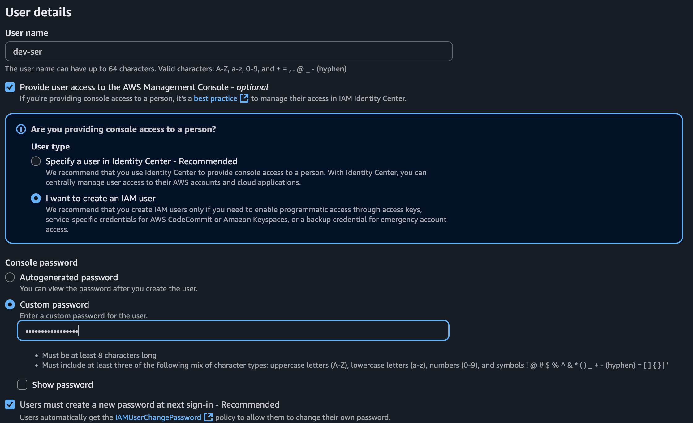
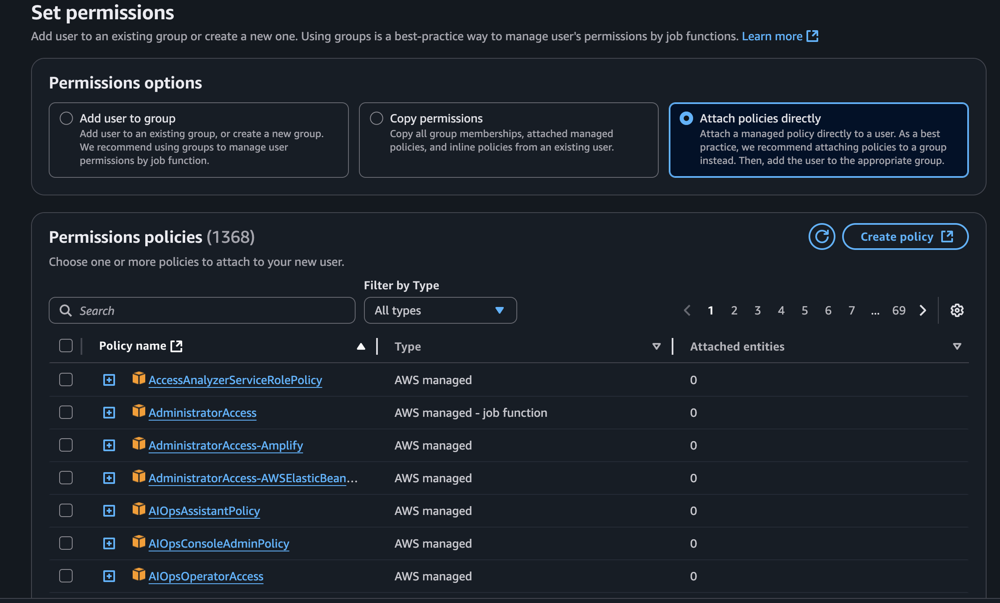

# Creating an IAM User on AWS

This guide explains how to create a new IAM user in AWS with programmatic and console access.

This is like a centralized Identity managment for entire AWS

---

## Step 1: Open IAM Console
- Sign in to the [AWS Console](https://console.aws.amazon.com/)
- In the search bar, type `IAM`
- Click on **IAM** to open the IAM dashboard


---

## Step 2: Navigate to Users
- In the left sidebar, click on **Users**
- Then click **Add users**


---

## Step 3: Add User Details
- **User name**: `bootcmp-user` (or any name you prefer)
- **Access type**: (optional)
  - Check **Programmatic access** (for CLI/SDK)
  - Check **AWS Management Console access** if UI login is needed
- Set a password (choose auto-generated or custom)



---

## Step 4: Set Permissions
- Choose **Attach existing policies directly**
- Select a policy like `AmazonS3ReadOnlyAccess` or `AdministratorAccess` for testing
- (You can also create a custom policy if needed)



---

## Step 5: Review and Create User
- Review all settings
- Click **Create user**


---

## Step 7: Save Credentials
- Save the **Access key ID** and **Secret access key**
- Download the `.csv` file or copy/paste securely

**Important:** You won’t be able to view the secret key again later.

---

## Optional: Test IAM Access
- Use the access key with AWS CLI:
```bash
aws configure
```

# Challenge

Create a user and add it to a group which can only access S3 bucket.

# Final ToDo

Post about your journey, what you learned on different platforms like LinkedIn, Twitter or any other of your favourite platforms. Follow up on your journey and share it with others! Use the Hashtags #NetAutoBootcamp #NetworkAutomation
You can also tag us on LinkedIn with @netauto-group-rheinmain